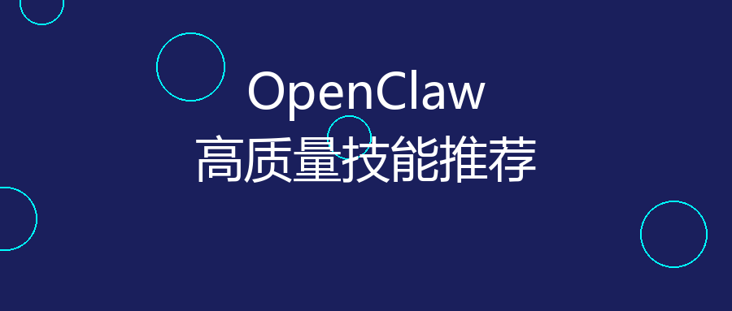

# 我把微信和Telegram连起来了，爽翻天



---

## 01

事情是这样的。

我有两个手机，一个工作号，一个私人号。微信、Telegram、WhatsApp 七八个群，每天消息轰炸。

最崩溃的是什么？是那种"在Telegram看到的重要通知，转头就忘了在哪"的无力感。

直到我装了 OpenClaw。

## 02

这玩意儿说实话，刚装的时候我觉得就是个玩具。

Node.js 装环境，配置 Gateway，折腾了半小时。但跑起来那瞬间，我服了。

**一句话：在自己电脑上装了个 AI 秘书，它能读我所有消息。**

不是那种云端隐私泄露的"智能助手"，是跑在我自己设备上的。

## 03

干了件小事。

让 OpenClaw 监控 Telegram 的技术群，发现有人发 Claude 相关的内容，自动同步到微信小号。

就这么简单。但我爽了整整一周。

因为以前要翻七八个群才能找到的干货，现在微信消息直接推过来。分类、标注、清爽。

## 04

研究了下它的架构，有点意思。

```
消息渠道 (Telegram/WhatsApp/微信)
        │
        ▼
   Gateway 控制平面
        │
   ┌────┼────┐
   ▼    ▼    ▼
 Agent  CLI  节点
```

**Gateway 是大脑**，所有消息先到这里。**节点是手**，在我电脑上执行具体操作。

最戳我的是这个设计：数据不过云，所有东西在我自己机器上。

## 05

用了两周，说说真实感受。

**爽的地方：**
- 多平台消息统一管理，再也不用切来切去
- Voice Wake 语音唤醒，喊一声就能干活
- Skills 市场，装个插件就能扩展功能

**不爽的地方：**
- 第一次配置确实麻烦
- macOS/Windows 体验有点差异
- 有些渠道还在 beta

## 06

但最让我感慨的，是这个项目的定位。

现在 AI Agent 满天飞，都是"云端服务"，都是"把你的数据给我们"。

OpenClaw 反着来：**你的设备，你的 AI，你的隐私。**

136k star 不是没道理的。大家苦"隐私换便利"久矣。

## 07

所以这篇想说啥？

**如果你也跟我一样，被七八个通讯工具折磨，试试 OpenClaw。**

不用搞什么大动作，就让它帮你同步个消息、自动化个提醒。

那种"终于不用手动搬砖"的感觉，值得。

---

**官网**：https://openclaw.ai
**GitHub**：https://github.com/openclaw/openclaw

---

*你有啥跨平台消息管理的痛点？评论区聊聊。*
